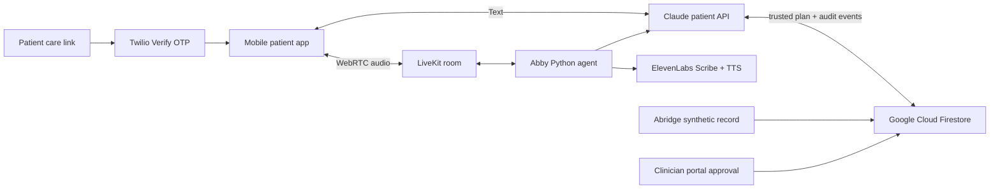

# Abby shared architecture

## Product boundary

Abby is one care episode with two deliberately separate web surfaces:

- `/` is Oliver's clinician/operator portal for synthetic Abridge records,
  outreach runs, Action Brief review, and approval.
- `/care/{opaquePatientId}` is the patient's mobile web app for verified intake
  and clinician-approved follow-through.

The patient app is not a second clinician dashboard. It receives only the
minimum patient-facing context assembled by the server for the current phase.

## Trust boundary

1. A care link contains a high-entropy synthetic patient identifier, not visit
   content or a LiveKit credential.
2. `patient-session` verifies the phone number through Twilio Verify and returns
   a signed, thirty-minute patient session.
3. `patient-context` derives the workflow from server-side run state. The
   browser cannot select pre-visit versus post-visit.
4. `patient-chat` loads the Abridge record and approved plan on the server. It
   never trusts chart context supplied by the browser.
5. `livekit-token` returns a ten-minute, room-scoped credential and dispatches
   the named `abby-care-agent` worker with identifiers only.
6. The voice worker retrieves its trusted context through `agent-context`.
   `agent-action` and `agent-event` revalidate every action and escalation.

## Server routes

| Route | Caller | Responsibility |
| --- | --- | --- |
| `patient-session` | patient browser | link bootstrap, OTP delivery, OTP verification |
| `patient-context` | verified patient | minimum phase-specific patient plan |
| `patient-chat` | verified patient | Claude conversation grounded in server context |
| `livekit-token` | verified patient | short-lived LiveKit room access and agent dispatch |
| `agent-context` | voice worker | trusted plan retrieval |
| `agent-event` | voice worker | questions, teach-back, and approved escalation audit |
| `agent-action` | voice worker | allowlisted action execution with receipts |

## Persistence

The existing Firestore REST adapter remains the shared persistence mechanism.
It stores runs, directory state, OTP challenges, and a bounded patient audit
ledger. In a local environment without Google credentials, these APIs use
serverless-memory fallback for synthetic demonstrations only.

## Remaining production hardening

- Add provider authentication and per-provider authorization to the existing
  clinician routes. They are currently a synthetic hackathon surface.
- Replace the one-document JSON adapter with episode-scoped Firestore documents
  and transactional updates before real clinical use.
- Store only approved Abridge artifacts and source references in patient-facing
  context; do not expose raw records to the browser.
- Complete security, privacy, clinical safety, accessibility, and operational
  reviews before using any real patient data.
